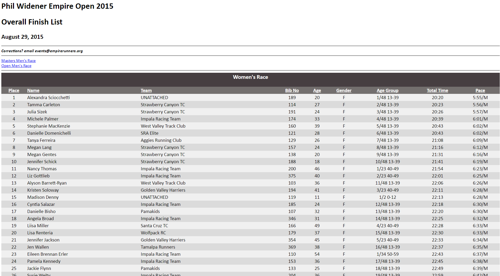

# Analyzing Race Results Part 1: Web Scraping

I enjoyed this analysis a lot, mainly because I found the data really fun to play with. It started as a way to learn how to scrape HTML data from a website, but then I decided that it would also be useful to dig a bit deeper with the data do a bit more analyzing and visualizing. It also provides an good opportunity to make use of various scientific Python libraries for data wrangling, data visualization, and statistical modeling.

The data that I use are the [2015](http://www.empirerunners.com/results/empireopen/eo15.html) and [2016](http://www.empirerunners.com/results/empireopen/eo16.html) results from the Empire Open Cross Country Meet - a 3.43 mile race that my running club hosts every year in Santa Rosa. The data has all of the typical information you'd expect to find in race results - team, age, gender, time, etc. 

The analysis can be broken up into the following steps:

1. **Web scraping and Data Cleaning** - use the ```BeautifulSoup``` Python library to scrape HTML data from a website

2. **Data Wrangling** - use ```Pandas``` grouping operations to reshape data into a more usable form and generate stats that compare team performances across years

3. **Data visualization** - use ```Matplotlib``` and its wrapper ```seaborn``` to generate plots that help visualize these comparisons

4. **Modeling** - use ```Statsmodels``` to built a basic linear regression model that can be used to control for age and gender when comparing times.

In this initial post, I will focus on the first aspect - obtaining and cleaning raw data from the web.


```python
#Import necessary Python modules

from bs4 import BeautifulSoup
import urllib2
import pandas as pd
from datetime import datetime, timedelta
import seaborn as sns
import matplotlib.pylab as plt
from matplotlib.cm import get_cmap
import numpy as np
%matplotlib inline
```

# Parsing HTML Data with ```BeautifulSoup```

Beautiful Soup is a Python library for parsing data out of HTML and XML files. It constructs a parse tree based on the HTML tags and provides a really easy way to navigate, search, and extract data based on these tags. 

Below, I specify the URL paths for each of the two years of data. For now, I'm going to parse only the 2015 results just as a way of demonstrating how to extract the data from HTML. I use ```urllib2``` to read in the website URL as a string of HTML code, and then I pass this string to ```BeautifulSoup``` to be parsed.


```python
years = [2015, 2016]
urls = ['http://www.empirerunners.com/results/empireopen/eo{}.html'.format(str(y)[2:]) for y in years]                   
                                                                           
html = urllib2.urlopen(urls[0]).read()
soup = BeautifulSoup(html, 'html.parser')
```

Below is a screenshot of the website that shows the data that I'm interesting in parsing. As you can see, there is a table structure that contains the race results.




Now, that I have passed the HTML code to ```BeautifulSoup``` I can call for specific tag objects to extract relevant data. I search for and print the 'title' tag below.


```python
print soup.find('title')
```

    <title>Phil Widener Empire Open 2015</title>
    

However, what I'm most interested in is the table that contains the results. First I use "find_all" to look for all elements with the "table" tag and confirm that there is only one table on the website.


```python
print len(soup.find_all('table'))
```

    1
    

Then I go ahead and extract the HTML code corresponding to the table and print it (part of it), using the ```prettify``` method which gives a better visual representation of the tree structure. The important things to note are the ```<td>``` and ```<tr>``` tags. ```<tr>``` is used to identify each row within a table and ```<td>``` identifies each cell whtin each row. As you can see the ```<td>``` tag always is nested within the ```<tr>``` tag. Knowing this structure allows us to parse apart the data elements.


```python
table = soup.find('table')
print table.prettify()[:750]
```

    <table border="0" cellpadding="0" cellspacing="0" class="racetable">
     <tr>
      <td class="h01" colspan="9">
       <h3>
        Women's Race
       </h3>
      </td>
     </tr>
     <tr>
      <td class="h11">
       Place
      </td>
      <td class="h12">
       Name
      </td>
      <td class="h12">
       Team
      </td>
      <td class="h11">
       Bib No
      </td>
      <td class="h11">
       Age
      </td>
      <td class="h11">
       Gender
      </td>
      <td class="h11">
       Age Group
      </td>
      <td class="h11">
       Total Time
      </td>
      <td class="h11">
       Pace
      </td>
     </tr>
     <tr>
      <td class="d01">
       1
      </td>
      <td class="d02">
       Alexandra Sciocchetti
      </td>
      <td class="d02">
       UNATTACHED
      </td>
      <td class="d01">
       189
      </td>
      <td class="d01">
       20
      </td>
      <td class="d01">
       F
      </td>
      <td class="d01">
       
    

Using a nested list comprehension along with the BeautifulSoup search tags, I can extract the data from the table in one line of code! I find all of the table rows by searching for the ```<tr>``` tag with the command ```table.find_all('tr')```. I find the cell values for each cell within each row by searching for the ```<td>``` tag using ```row.find_all('td')```. I extract only the text identified by these tags and use the ```strip()``` method to get rid of white space. The result is a nested list of all of the table data elements. 


```python
raw_data = [[cell_value.text.strip() for cell_value in row.find_all('td')] for row in table.find_all('tr')]
raw_data[:4]
```


    [[u"Women's Race"],
     [u'Place',
      u'Name',
      u'Team',
      u'Bib No',
      u'Age',
      u'Gender',
      u'Age Group',
      u'Total Time',
      u'Pace'],
     [u'1',
      u'Alexandra Sciocchetti',
      u'UNATTACHED',
      u'189',
      u'20',
      u'F',
      u'1/48 13-39',
      u'20:20',
      u'5:55/M'],
     [u'2',
      u'Tamma Carleton',
      u'Strawberry Canyon TC',
      u'114',
      u'27',
      u'F',
      u'2/48 13-39',
      u'20:23',
      u'5:56/M']]


However, there are a few aspects of this table that will need to be cleaned before we are ready to use the data. First, you'll notice that the first element of the list is a list is the table title. It will also appear later in the data for the "Men's Race". Then, the second element of the list is the table header. For some reason, this header also re-appears as a row in the data every 100 rows. Nonetheless, all of this is easy to filter out. Below I clean the data and then read it into a dataframe.


```python
#Identify the header as the first row that has a length of 9 (excludes the title)
header = [row for row in raw_data if len(row) == 9][0]

#Loop through each row and only append those rows that are not table titles (length<>9) or table headers
cleaned_data =[]
for row in raw_data:
    if row <> header and len(row) == 9:
        cleaned_data.append(row)
        
print pd.DataFrame(data = cleaned_data, columns = header).head()
```

      Place                   Name                    Team Bib No Age Gender  \
    0     1  Alexandra Sciocchetti              UNATTACHED    189  20      F   
    1     2         Tamma Carleton    Strawberry Canyon TC    114  27      F   
    2     3            Julia Sizek    Strawberry Canyon TC    191  24      F   
    3     4         Michele Palmer      Impala Racing Team    174  33      F   
    4     5    Stephanie MacKenzie  West Valley Track Club    160  39      F   
    
        Age Group Total Time    Pace  
    0  1/48 13-39      20:20  5:55/M  
    1  2/48 13-39      20:23  5:56/M  
    2  3/48 13-39      20:26  5:57/M  
    3  4/48 13-39      20:39  6:01/M  
    4  5/48 13-39      20:43  6:02/M  
    

Now that I understand the structure of the data, I am ready to loop through each of the two years; process the data and then combine them into a dataframe. To make things easier, I first write a function that takes the data from ```BeautifulSoup``` and cleans it, taking the steps shown above.


```python
def parse_results_table(url):
    html = urllib2.urlopen(url).read()
    soup = BeautifulSoup(html, 'html.parser')
    table = soup.find('table')
    raw_data = [[cell_value.text.strip() for cell_value in row.find_all('td')] for row in table.find_all('tr')]
    
    header = [row for row in raw_data if len(row) == 9][0]

    cleaned_data =[]
    for row in raw_data:
        if row <> header and len(row) == 9:
            cleaned_data.append(row)

    return pd.DataFrame(data = cleaned_data, columns = header)
```


```python
df = pd.DataFrame()
for year, url in zip(years, urls):
    d = parse_results_table(url)
    d['Year']=year
    df = df.append(d)
```

Now there are just a few small cleaning steps and I'm ready to analyze the data. A key field in this analysis will be the "Total Time" field which is currently represented as a string. I write a function to convert this string to a ```timedelta``` object and then also calculate the time in minutes as a ```float``` (this will be useful for some of the plotting functions I do later). Lastly, I sort the values by Time and export the dataset.


```python
def convert_date_string_to_datetime(time_string):
    t=datetime.strptime(time_string, "%M:%S")
    delta = timedelta(minutes=t.minute, seconds=t.second)
    return delta

df['Time']= df['Total Time'].apply(convert_date_string_to_datetime)
df['Minutes'] = df['Time'].dt.seconds/60
df[['Place' ,'Age', 'Bib No']] = df[['Place' ,'Age', 'Bib No']].astype(int)
df = df.sort_values(by = 'Time').reset_index(drop=True)

df.to_pickle('cleaned_race_results.p')
print df.head()
```

       Place              Name                    Team  Bib No  Age Gender  \
    0      1      Isaac Chavez     Aggies Running Club     414   24      M   
    1      2  Malcolm Richards  West Valley Track Club     306   32      M   
    2      1    Trevor Halsted              UNATTACHED     701   23      M   
    3      2  Malcolm Richards  West Valley Track Club     623   33      M   
    4      3  Alfonso Cisneros     Aggies Running Club     413   23      M   
    
        Age Group Total Time    Pace  Year     Time    Minutes  
    0  1/52 16-99      16:51  4:54/M  2015 00:16:51  16.850000  
    1  2/52 16-99      16:56  4:56/M  2015 00:16:56  16.933333  
    2     1 16-99      16:56  4:56/M  2016 00:16:56  16.933333  
    3     2 16-99      17:05  4:59/M  2016 00:17:05  17.083333  
    4  3/52 16-99      17:07  4:59/M  2015 00:17:07  17.116667  
    

And that's it! Now I have a dataset that is cleaned and ready to analyze.
